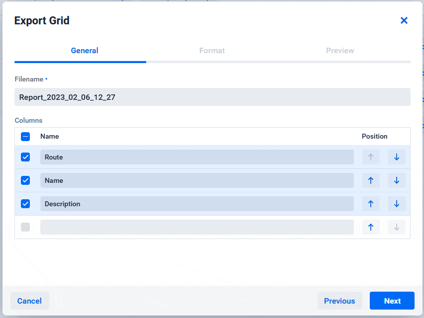

[](https://vaadin.com/directory/component/gridexporter-for-vaadin)
[](https://mvnrepository.com/artifact/software.xdev/vaadin-grid-exporter)
[](https://github.com/xdev-software/vaadin-grid-exporter/actions/workflows/check-build.yml?query=branch%3Adevelop)


# GridExporter for Vaadin

The Vaadin Grid Exporter can convert nearly any Vaadin Grid to a variety of formats.<br/>
This way you don't have to copy the Grid contents manually or print the whole website with the Grid.

Out of the box supported formats:
* CSV
* Word (DOCX)
* HTML
* ODS
* ODT
* PDF
* PowerPoint (PPTX)
* RTF
* Plain text
* Excel (XLSX)

_These formats are exported using [dynamicreports](https://github.com/xdev-software/dynamicreports-core-for-grid-exporter)._

It's also easy to extend the Exporter to support your custom format.



> [!NOTE]
> <details><summary><b>Disclaimer about the scope of this component</b> (click to expand)</summary>
>
> Although the GridExporter can handle most use-cases, extreme scenarios will likely impact performance, usability and might require some hacks.<br/>
> For such cases custom written exports are recommended e.g. by utilizing JasperReports directly.<br/>
> If you need help implementing these feel free to [contact us](#support) or open a [question](https://github.com/xdev-software/vaadin-grid-exporter/issues/new?assignees=&labels=question&projects=&template=question.yml) if you are not sure that the GridExporter is a good option for your scenario.
>
> </details>

## Usage

Default usage:

```java
GridExporter
	.newWithDefaults(this.grExamples)
	.open();
```

Custom format (see [JsonGridExporterProvider from Demo](vaadin-grid-exporter-demo/src/main/java/software/xdev/vaadin/gridexport/example/jsonext/JsonGridExporterProvider.java)):

```java
GridExporter
	.newWithDefaults(this.grExamples)
	.loadFromProvider(new JsonGridExporterProvider())
	.open();
```

## Installation

[Installation guide for the latest release](https://github.com/xdev-software/vaadin-grid-exporter/releases/latest#Installation)

### Comaptibility with  ``CSP`` (Content-Security-Policy) and ``X-Frame-Options``

> [!TIP]
> In Spring Security the [default value of ``X-Frame-Options`` is ``DENY``](https://docs.spring.io/spring-security/reference/features/exploits/headers.html#headers-frame-options) which will break the preview if not changed.

To show the preview the [CSP](https://developer.mozilla.org/en-US/docs/Web/HTTP/Headers/Content-Security-Policy) or the [X-Frame-Options](https://developer.mozilla.org/en-US/docs/Web/HTTP/Headers/X-Frame-Options) (deprecated in favor of CSP) must be configured in a way that they allow showing same-site elements.

This can be achieved by:
* setting the CSP to include at least ``frame-ancestors 'self'`` and maybe additionally ``object-src 'self'``
* setting ``X-Frame-Options`` to ``SAMESITE``.<br/>If you use Spring Security without a CSP the easiest way to set this is:
    ```java
    http.headers(c -> c.frameOptions(HeadersConfigurer.FrameOptionsConfig::sameOrigin));
    ```

> [!NOTE]
> Depending on the browser the settings sometimes have slightly different effects.<br/>
> For example Firefox blocks the preview due to privacy reasons when ``X-Frame-Option=DENY`` and ``Content-Security-Policy=frame-ancestors 'self'; object-src 'self'; ...`` but Chrome does not.

### Compatibility with Vaadin

| Vaadin version | GridExporter version |
| --- | --- |
| Vaadin 25+ (latest) | ``4+`` |
| Vaadin 24 | ``3.x`` |
| Vaadin 23 | ``2.x`` |

### Compatibility with JasperReports

Starting with version [3.1.0](./CHANGELOG.md#310) JasperReports 7 is required.

### Spring-Boot
* You may have to include ``software/xdev`` inside [``vaadin.allowed-packages``](https://vaadin.com/docs/latest/integrations/spring/configuration#configure-the-scanning-of-packages)

## Run the Demo
* Checkout the repo
* Run ``mvn install && mvn -f vaadin-grid-exporter-demo spring-boot:run``
* Open http://localhost:8080

<details>
  <summary>Show example</summary>
  
  
</details>

## Support
If you need support as soon as possible and you can't wait for any pull request, feel free to use [our support](https://xdev.software/en/services/support).

## Contributing
See the [contributing guide](./CONTRIBUTING.md) for detailed instructions on how to get started with our project.

## Dependencies and Licenses
View the [license of the current project](LICENSE) or the [summary including all dependencies](https://xdev-software.github.io/vaadin-grid-exporter/dependencies)
